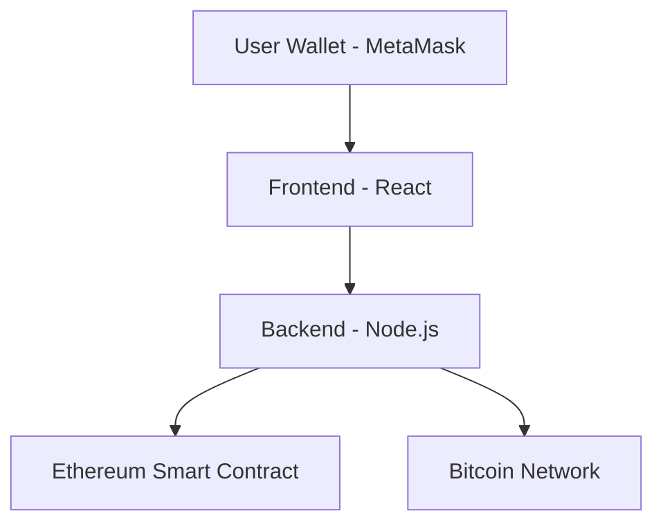

# Atomic Swap Application - Design Architecture

## Overview

This application enables trustless cross-chain atomic swaps between Ethereum and Bitcoin. An atomic swap allows two parties to exchange cryptocurrencies across different blockchains without requiring a trusted third party or centralized exchange.

## System Architecture

The application follows a three-tier architecture:

1. **Frontend**: React-based user interface
2. **Backend**: Node.js API server
3. **Blockchain Layer**: Ethereum smart contract and Bitcoin scripts

## Components

### Frontend (React)

- **SwapInterface**: Handles creation of new swaps
- **SwapStatus**: Monitors and manages existing swaps
- **WalletConnection**: Manages Ethereum wallet connectivity

The frontend communicates with the backend via REST API calls and directly with the Ethereum blockchain via MetaMask and ethers.js.

### Backend (Node.js)

- **API Server**: Express.js server providing endpoints for swap management
- **Ethereum Connector**: Connects to Ethereum node using ethers.js
- **Bitcoin Handler**: Manages Bitcoin transactions and scripts

The backend maintains an in-memory store of active swaps and provides API endpoints for creating, monitoring, and completing swaps.

### Smart Contracts

- **AtomicSwap.sol**: Solidity contract that handles the Ethereum side of the swap
  - Implements HTLC (Hashed Timelock Contract) pattern
  - Supports both ETH and ERC20 tokens
  - Includes timelock functionality for safety

### Bitcoin Scripts

- **atomicSwap.js**: Creates and manages Bitcoin P2SH scripts for atomic swaps
  - Implements Bitcoin-compatible HTLC
  - Handles secret generation and verification
  - Creates Bitcoin addresses for the swap

## Data Flow

### ETH to BTC Swap Flow

1. Initiator generates a secret and its hash
2. Initiator locks ETH in the Ethereum smart contract with the hash
3. Recipient verifies the ETH lock and locks BTC with the same hash
4. Recipient claims ETH by revealing the secret
5. Initiator uses the revealed secret to claim BTC

### BTC to ETH Swap Flow

1. Initiator generates a secret and its hash
2. Initiator locks BTC in a P2SH address with the hash
3. Recipient verifies the BTC lock and locks ETH with the same hash
4. Recipient claims BTC by revealing the secret
5. Initiator uses the revealed secret to claim ETH

## Security Considerations

- **Timelock**: All swaps have a timelock to prevent funds from being locked forever
- **Secret Management**: The secret is critical and must be securely stored
- **Verification**: All transactions are verified on both chains before proceeding

## Deployment Architecture

- **Local Development**: Hardhat for Ethereum, local Bitcoin node (optional)
- **Testnet**: Sepolia for Ethereum, Bitcoin testnet
- **Production**: Ethereum mainnet, Bitcoin mainnet

## Future Enhancements

- Database persistence for swaps
- Support for additional blockchains
- Enhanced monitoring and notifications
- Automated swap completion
- Fee optimization strategies